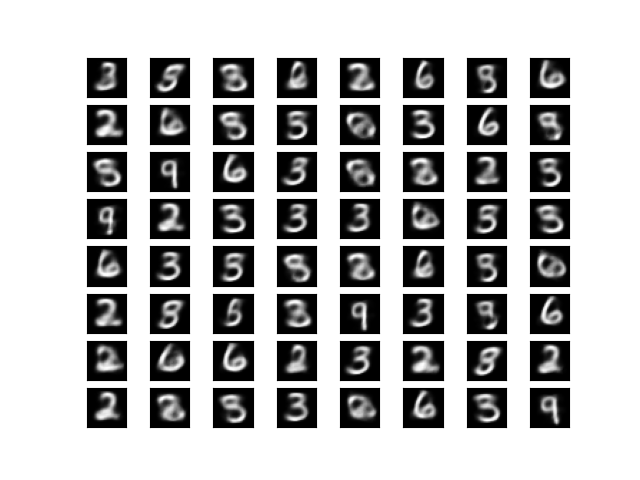
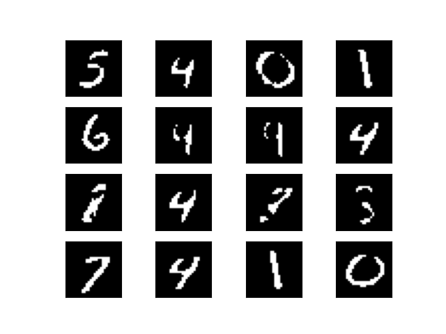
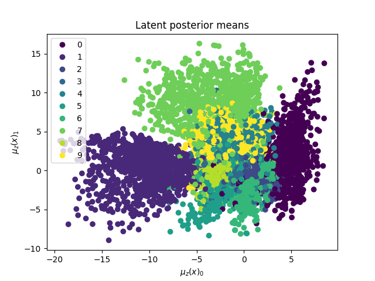

# Variational Autoencoder

Read about VAEs recently and wanted some more JAX practice.

## Samples
*All samples from a model train with 2 latent variables*

**Generated Samples**:
Sampled latents from prior and fed through encoder. 


**Reconstructions**:



**Scatterplot of posterior means**:
Scatter plot of means of latents from decoder.


## Code

```bash
# clone and install requirements
git clone https://github.com/fattorib/jaxvae.git
pip install -r requirements

# start aim for tracking
aim up 

# train model
python main.py
```

